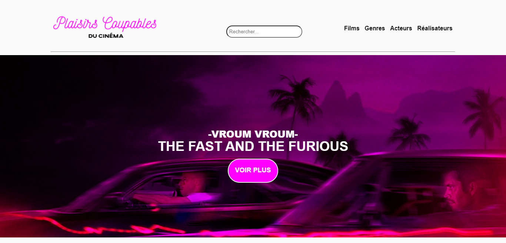

<h2>EN :</h2> 
 
<q><i>We all have our guilty pleasures, those movies that we love, but are a little ashamed of, those movies that aren't really good, but that we can't stop loving.</i></q>

 <ul><<h4>Basic Function:</h4>
  <li>list the information about movies, their director and their actors.</li>

</ul>
 
<ul>
  <h4>Advanced Functions:</h4>
  <li>Allow user registration and login.</li>
  <li>Allow movies, actors , and directors creation edit and delete.</li>
</ul>
 

Back-end | Front-end
------------ | -------------
PHP 7.4 | CSS 3
SQL | Javascript ES6

*(This project is part of my profesional certification Web Developer.)*
 
 
<h2>FR :</h2> 
 
<q><i>Nous avons tous nos plaisirs coupables, ces films qu'on adore, mais dont on a un peu honte, ces films pas vraiment bons, mais qu'on ne peut pas s'empêcher d'aimer.</i></q>

 <ul><<h4>Fonctionnalité générale:</h4>
  <li>list the information about movies, their director and their actors.</li>

</ul>
 
<ul>
  <h4> Advanced Function:</h4>
  <li>Permettre une inscription et une connexion des utilisateurs.</li>
  <li>Autoriser la création et la suppression et la modification de films, d'acteurs et de réalisateurs.</li>
</ul>
 

Back-end | Front-end
------------ | -------------
PHP 7.4 | CSS 3
SQL | Javascript ES 6

*(Ce projet a été réalisé dans le cadre de mon titre professionnel Développeur Web.)*
